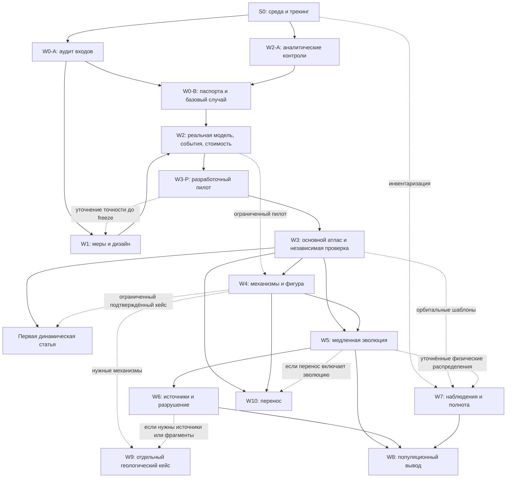

# Последовательность исследования и правила перехода между этапами

Для пользователя и всех исследовательских агентов. Версия: 2026-09-23.

**Программа выполняется по зависимостям научных продуктов, а не строгой линейкой W0 → W10.** Последовательность обязательна там, где вывод опирается на проверенные данные и методы предыдущего этапа. Подготовка независимых частей может идти параллельно. Цели последующих работ уточняются по фактическим результатам; история прежних постановок сохраняется.

Это карта маршрута и условий перехода. Актуальные статусы — [STATE.md](STATE.md) и [PLAN.md](PLAN.md); подробные цели и действия — [досье W0–W10](docs/stages/README.md); правила записи изменений — [TRACKING_SYSTEM.md](TRACKING_SYSTEM.md).

## 1. Насколько важна последовательность

Нельзя интерпретировать атлас до проверки параметров, меры, сил и событий; оценивать населённость без определённой полноты и модели источников; объявлять переносимость по данным, использованным для подбора объяснения. Эти зависимости являются обязательными.

При этом задача «прочитать статью», аналитический двухтельный тест, проект статистического протокола и поиск доступных архивных кадров не требуют последовательного ожидания друг друга. **Начало подготовительных работ этапа и допуск к его основному научному результату — разные контрольные точки.**

Есть взаимодействие W0 и W2: W0 должен воспроизвести базовый случай, но для этого уже нужен проверенный численный аппарат. Поэтому W2 начинается с аналитических контролей до полного завершения W0; затем проверяет реальную модель на аудированных входах. Формального требования «полностью завершить W0 прежде любой работы W2» нет. В PLAN зависимости показывают основную передачу продуктов, а не запрет таких подготовительных работ.

## 2. Оптимальный маршрут к первой статье

При одном основном исполнителе сохраняется этот порядок приоритетов; при нескольких агентах указанные независимые ветви можно вести одновременно.

| Шаг | Основная работа | Что допустимо параллельно | Условие перехода |
|---|---|---|---|
| 0 | S0: рабочее пространство, среда, provenance и трекинг | Подготовка списка источников | Исполняемый контроль и сохранение состояния проверены |
| 1 | W0-A: статья, приложения, первичные параметры, неоднозначности | W1-A: проект показателей; W2-A: аналитические контроли; W7-A: инвентаризация | У реального пилота есть проверяемые входы и явная постановка |
| 2 | W0-B: паспорта и воспроизведение стартов/базового случая; W1-B: область и меры | W2-B: силы, координаты, события и независимые методы | Ошибки постановки устранены либо явно ограничены; определено, что измеряем |
| 3 | W2-C: сходимость, рестарт, стоимость; малый разработочный пилот W3-P | W4-P: ограниченный механистический пилот; уточнение плана точности W1 | Бюджет измерен; основной дизайн и независимые предсказания фиксированы до раскрытия их исходов |
| 4 | W3-M: основной сопоставимый атлас | Ограниченный W4; W7-P, если архивный материал пригоден | Получены оценочные исходы и контрольная группа; неопределённость измерена |
| 5 | W3-V и W4: независимые проверки, физическая интерпретация, чувствительность | Сборка воспроизводимых рисунков и текста методов | Закрыты научные критерии, есть новый сравнительный вывод |
| 6 | Первая статья и достаточный выпуск данных | План следующего физического или наблюдательного направления | Главные выводы прослеживаемы, воспроизведены и ограничены областью применимости |

Суффиксы A/B/C/P/M/V здесь обозначают рабочие части существующих этапов, не новые обязательные научные направления. В трекинге они оформляются задачами внутри W0, W1, W2, W3 или W4. До появления измеренной стоимости это порядок работ, а не обещание календарных сроков.

На первой научной развилке приоритет остаётся у **W0–W3 с ограниченным W4**. Полный W5, W6, W8 и W9 не должны задерживать самостоятельную динамическую статью. W7 способен дать отдельный результат независимо от успешности полной эволюционной модели.

## 3. Блок-схема зависимостей

Сплошная стрелка обозначает передачу требуемого продукта; пунктир — подготовку, условный вход или обратную связь. Граф показывает крупные связи, подробные условия приведены в таблицах.

Пунктирная обратная связь пилота с W1 не разрешает подгонять окончательную гипотезу по её независимой проверке: разработочные и проверочные данные разделяются, изменения фиксируются до следующей проверки.

## 4. Входы, результаты и допустимые пересечения этапов

| Этап | Что нужно для содержательного результата | Что можно начинать раньше | Что передаётся дальше |
|---|---|---|---|
| W0 | Первоисточники и контроль численного воспроизведения | Инвентаризация, паспортные схемы | Проверенные параметры, состояния, L1 и нерешённые неоднозначности |
| W1 | Аудированные области/параметры W0, сведения о стоимости и дисперсии пилота для окончательного объёма | Математика мер и проект протокола | Генератор, веса, frozen-показатели, интервалы и правила остановки |
| W2 | Явные входы W0, определённые величины W1 | Аналитические задачи, тесты форматов и регистрации | Допустимый численный режим, бюджет ошибки, события, checkpoint и стоимость |
| W3 | Проверенные W0–W2 | Только явно разработочный пилот, не принятый атлас | Карты, исходы, неопределённость, контроль и sensitivity |
| W4 | Проверенный аппарат W2, информативные случаи W3, данные поля/вращения | Отбор механизмов и ограниченный пилот параллельно W3 | Подтверждённые механизмы и область применимости упрощений |
| W5 | Проверенные области W3–W4 и физические параметры медленных процессов | Поиск параметров, аналитические оценки масштаба | Условные времена жизни и проверенные ядра переходов |
| W6 | Подходящие результаты W3–W5 и ограничиваемые источники/разрушение | Обзор ударных данных и идентификация отсутствующих параметров | Ядра рождения/разрушения и допустимая нормировка |
| W7 | Реально пригодные кадры, калибровки, геометрия, независимые инъекции | Инвентаризация уже при W0 | Наблюдательный оператор, полнота, кандидаты или условные пределы |
| W8 | Совместимые продукты W5–W7 и нужные части W3–W4 | Формальный прототип likelihood на синтетике | Идентифицируемые комбинации и предсказания для новых данных |
| W9 | Отдельное различающее предсказание и геологические входы; конкретные физические компоненты по выбранному сценарию | Поиск ограничений и воспроизведение опубликованной упрощённой модели | Сравнение геологических сценариев; не обязательный вход первой статьи |
| W10 | Проверенные W3–W4, отложенные системы; W5, если заявлен перенос эволюции | Отбор безразмерных параметров | Формула/суррогат с ошибками и областью переносимости |

Для W7 завершение всех W5–W6 не требуется. Если используются конкретные динамические распределения, они должны иметь проверенное происхождение; их отсутствие не запрещает инвентаризацию или независимую инструментальную оценку полноты.

Для W9 нет требования сначала формально закрыть все остальные этапы. Нужны именно те проверенные механизмы и данные, которые используются в выбранной геологической постановке. Номера W9 и W10 не задают календарную очередь.

## 5. Как корректировать последующие цели по результатам

**Да, цели, задачи и охват последующих этапов будут уточняться.** Постоянна общая цель — новое проверяемое утверждение о динамике, эволюции и обнаружимости. Конкретный хозяин, физический механизм, горизонт, наблюдательная серия и достижимая точность выбираются по доказательствам.

| Что обнаружено | Как меняется дальнейшая работа |
|---|---|
| W0: входы статьи неоднозначны или содержат несогласованность | Разделить точное повторение и собственную явную постановку; пересчитать затронутые случаи |
| W1/W3: рейтинг зависит от меры | Следующий вопрос — механизм этой зависимости и границы сравнительных утверждений |
| W2: исходы чувствительны к событию или допуску | Исправить численную причину и повторить затронутые проверки до расширения атласа |
| W2: стоимость слишком велика | Сузить вторичный охват, проверить ускорение или подготовить согласование внешних ресурсов |
| W4: эффект фигуры ограничен как малый с достаточной точностью | Зафиксировать верхний предел и не масштабировать заведомо неинформативный механизм |
| W4/W5: неизвестность поля/спина доминирует | Приоритет параметрическим ограничениям и сценариям, а не большему числу одинаковых орбит |
| W7: архив не даёт новой чувствительности | Выбрать другую серию/инструмент либо завершить количественным ограничением возможностей |
| W6: нормировка источника не ограничена | Передавать условные ядра; не публиковать произвольное абсолютное население |
| W8: данные определяют только произведение параметров | Публиковать идентифицируемую комбинацию и выбирать различающие измерения |
| W10: предсказатель провалился на новом хозяине | Сузить область применения, проверить недостающий параметр и назначить новый независимый тест |

Слабая статистическая значимость при недостаточной мощности не является доказательством малого эффекта. Неудобный результат не удаляется и не служит причиной заменить уже просмотренную проверочную выборку без записи этого факта.

## 6. Обратная связь от параллельной ветви

Коррекция допустима и часто необходима. Пример: W7 выявил покрытие другого хозяина; это может изменить приоритет орбитальных шаблонов. W4 обнаружил существенную поправку фигуры; W3 должен проверить, затронуты ли его основные выводы.

Порядок изменения:

1. Зарегистрировать результат/проблему в породившем её этапе с проверкой и ограничениями.
2. Перечислить затронутые assumptions, задачи, конфиги, run_id и утверждения других этапов.
3. Зафиксировать решение: что сохраняется, что уточняется, что временно приостанавливается и почему.
4. Обновить будущие задачи и необходимую постановку новой версии; прошлые завершённые серии сохранить.
5. Если меняется проверяемая модель после просмотра holdout, отметить потерю независимости; использовать новый тест или явно ограничить вывод.
6. Выполнить повторные проверки именно затронутых продуктов; не перезапускать автоматически всю программу без причины.

Обратная связь не означает, что работа всех агентов останавливается: блокируются зависимые выводы, остальные задачи продолжаются. При нескольких исполнителях назначаются отдельные owner и файлы; общие изменения согласует координирующий агент через журнал.

## 7. Что означает переход к следующему этапу

Цели и результаты предыдущих этапов **обязательны как входы**, когда на них опирается новая работа. Недостаточно увидеть статус complete. Исполнитель проверяет точный набор продуктов, версию, выполненные проверки и оставшиеся ограничения.

Передача оформляется по [шаблону](docs/templates/stage_handoff.md):

- Откуда и куда: stage/task/result ID.
- Какой вопрос теперь можно решать и какие предыдущие цели выполнены.
- Точные файлы, run_id, версии/хеши и единицы.
- Критерии приёмки и ссылки на проверки.
- Открытые проблемы и пределы использования.
- Какие задачи следующего этапа разрешены, какие остаются условными.
- Один ближайший исполнимый шаг и ответственный.

В журнале получателя создаётся задача с related_ids на входные результаты; запись этапа обновляется явно. Автоматический рендер показывает новое состояние, но сам не объявляет научные ворота закрытыми.

## 8. Можно ли добавлять новые этапы

**Да, программа адаптивна; W0–W10 — исходная сбалансированная структура, а не запрет на развитие.** Сначала проверить, можно ли сформулировать новое исследование как задачу или подэтап существующего направления. Новая строка нужна для самостоятельного вопроса с собственным проверяемым продуктом, существенными зависимостями и отдельными критериями завершения.

Примеры основания: обнаружен важный ранее неучтённый механизм, получен кандидат, требующий самостоятельной программы подтверждения, или возникла новая наблюдательная серия с отдельным методом. Само увеличение объёма интеграций не требует нового научного этапа.

Порядок добавления:

1. Решение с новым вопросом, основанием, альтернативами, ценой и влиянием на первую публикацию.
2. Проверить приоритет: не вытесняет ли расширение обязательную верификацию или завершённый основной результат.
3. Назначить устойчивый новый ID, сохранив W0–W10 без перенумерации. Подзадачи остаются внутри исходного этапа.
4. Для нового этапа добавить цель/входы/выходы/критерии в каноническую программу и `tracking/project.yaml`, проверить отсутствие непреднамеренного цикла зависимостей.
5. Добавить раздел в `docs/stages/catalog.yaml`, пересобрать досье и обновить общую картину/эту карту маршрута.
6. Создать запись `<ID>-STAGE` и задачи через общий трекер; сохранить решения об отложенных или заменённых действиях.

Изменение схемы или бюджета оформляется до затрат. Новая облачная серия подчиняется [политике прямого согласования расходов](docs/compute_policy.md). Появление научного основания для расширения не означает автоматическое разрешение аренды.

## 9. Что читает агент для выбора следующего шага

1. AGENTS → STATE: правила, текущий фокус и состояние проекта.
2. [Общая картина](docs/context/project_overview.md): смысл всего исследования.
3. SUMMARY этапа + его [полное досье](docs/stages/README.md): текущая фаза и подробная постановка.
4. Этот маршрут — при выборе очередности, параллельной ветви или переходе между этапами.
5. Запись задачи, передаваемые результаты и обязательные тематические блоки — перед исполнением.

Рабочая стратегия: сначала устранить неопределённость, препятствующую ближайшему научному выводу; затем выполнить необходимый расчёт/наблюдательный тест; после результата пересмотреть следующий шаг. Нумерация этапов помогает ориентироваться, но последовательностью управляют проверенные зависимости.
