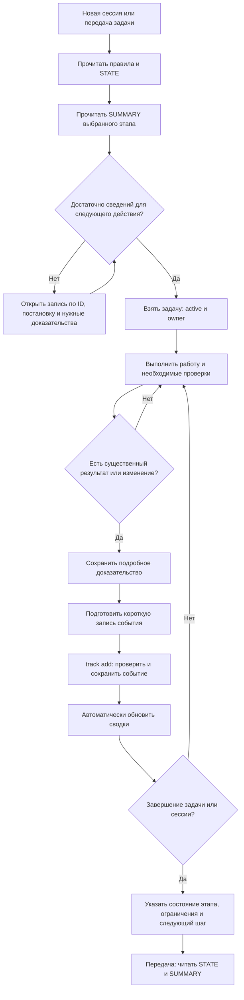
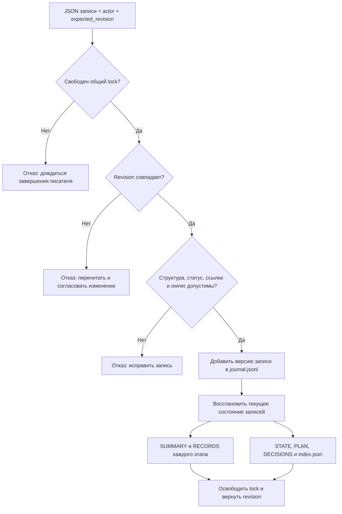

# Как работает трекинг исследования и быстрое чтение контекста

Версия описания: **1.0, 23 сентября 2026 года**.

Этот документ предназначен для пользователя: он объясняет алгоритм, автоматизацию, обязанности агентов и ограничения системы. [PROJECT_MAP.md](PROJECT_MAP.md) помогает найти файлы, [технический протокол](docs/tracking_protocol.md) задаёт правила их ведения, а [STATE.md](STATE.md) показывает фактическое состояние исследования.

## 1. Основная идея

У проекта есть **одна история изменений и несколько представлений этой истории**. Агент записывает существенное событие в журнал соответствующего этапа. Программа проверяет запись, сохраняет новую версию и перестраивает сводки для человека и следующего агента.

Подробные доказательства — исходные данные, параметры расчёта, отчёт проверки — хранятся в собственных файлах. Короткая запись трекинга связывает их устойчивым идентификатором и ссылками. Поэтому агент может сначала получить краткую картину, а затем открыть только необходимые подробности.

**Автоматизация здесь имеет конкретную границу:** скрипт автоматически проверяет и сохраняет переданное событие, обновляет индексы и сводки. Решение о том, что произошло содержательное событие и что оно означает научно, принимает исполняющий агент. Фонового наблюдателя за файлами, автоматического чтения мыслей агента или службы, работающей после окончания диалога, сейчас нет.

## 2. Какие файлы за что отвечают

| Файл или группа | Содержание | Кто и когда обновляет |
|---|---|---|
| `AGENTS.md` | Постоянные правила и порядок чтения | Разработчик при изменении рабочих правил |
| `tracking/project.yaml` | Этапы, зависимости, критерии завершения, текущий фокус | Координирующий агент при изменении плана; затем `track render` |
| `tracking/stages/<этап>/journal.jsonl` | История всех версий записей этапа | Команда `track add` после содержательного события |
| `tracking/stages/<этап>/SUMMARY.md` | Короткое состояние этапа и выбранные актуальные записи | Автоматический рендер |
| `tracking/stages/<этап>/RECORDS.md` | Все текущие записи этапа с доказательствами | Автоматический рендер |
| `STATE.md` | Текущий фокус, состояние, следующий шаг и статусы этапов | Автоматический рендер |
| `PLAN.md` | Все этапы, зависимости и следующие действия | Автоматический рендер |
| `DECISIONS.md` | Индекс решений всех этапов, включая отклонённые | Автоматический рендер |
| `tracking/index.json` | Полная машинная проекция текущих записей | Автоматический рендер; для инструментов, не обычного чтения целиком |
| `tracking/runtime.json` | Зарегистрированные фоновые процессы и последнее наблюдение за ними | Агент или будущий runner при запуске, проверке и остановке |
| `docs/tasks/`, `docs/predictions/` | Постановки задач и проверяемые предсказания | Агент до исполнения и при явно оформленном пересмотре |
| `reports/`, `results/`, `runs/` | Подробные отчёты, данные и доказательства | Исследовательский код и агент по факту работы |
| `PROJECT_MAP.md` | Пользовательское оглавление файлов | Вручную по отдельному запросу; рендер его не трогает |
| `TRACKING_SYSTEM.md` | Это объяснение устройства системы | По запросу или при изменении реализации трекинга |

Текущие статусы не нужно вручную согласовывать между STATE, PLAN и карточками задач: их источник — журнал. В подробной карточке находятся требования задачи и ссылка на её актуальную запись. `docs/roadmap.md` и `docs/bootstrap_decisions.md` сохраняют первоначальное планирование и основания решений; они не заменяют действующий трекер.

## 3. Общая блок-схема



Если задача пока не может выполняться, агент регистрирует конкретное препятствие и продолжает доступную независимую работу. Отсутствие желаемого научного эффекта само по себе не является технической блокировкой.

## 4. Алгоритм чтения: обязательное и по необходимости

### При входе в новую сессию

1. **Обязательно:** прочитать `AGENTS.md`, если действующая версия ещё не предоставлена harness. Повторно загружать тот же текст в том же контексте не нужно.
2. **Обязательно:** прочитать `STATE.md`. Узнать текущий фокус, следующий шаг и состояния связанных этапов.
3. **Обязательно для выбранной работы:** прочитать `tracking/stages/<этап>/SUMMARY.md` и зафиксировать `Revision`.
4. **Обязательно перед научной работой:** прочитать [общую картину проекта](docs/context/project_overview.md), полное `docs/stages/<этап>.md`, его обязательные тематические блоки, конкретную задачу и необходимые входы. Неизменённые документы, уже находящиеся в контексте, повторно загружать не нужно. Краткая сводка не заменяет уравнения, ограничения задачи или проверяемый источник.
5. **По необходимости:** открыть PLAN, DECISIONS, полную запись, соседний этап или конкретное доказательство.

Если впервые выполняется научный модуль, нужны соответствующие разделы научной программы и математической спецификации. После передачи контекста достаточно восстановить нужные разделы; вся программа W0–W10 не требуется для каждой небольшой правки.

Для этого созданы [досье всех этапов W0–W10](docs/stages/README.md): внутри полный научный раздел без сокращения, рабочий план, обязательные входы/выходы и условия передачи. Общие §3, §4, §16, §17, §18–19 выделены в тематические блоки. `build_stage_briefs.py --check` сверяет их с каноническим исходником. Полное перечитывание программы нужно при первоначальном общем аудите, крупных изменениях архитектуры или межэтапных противоречиях; регулярного расписания полного перечитывания нет.

### Когда углублять чтение

| Ситуация | Дополнительное обязательное чтение |
|---|---|
| Продолжить известную задачу | Запись задачи, её постановка, последнее существенное доказательство |
| Изменить ранее принятое решение | Предыдущее решение, причины выбора и отвергнутые альтернативы |
| Исправить ошибку | Issue, воспроизведение, область влияния, связанные результаты и проверки |
| Интерпретировать расчёт | Манифест, применённая конфигурация, исходы, validation и ограничения |
| Проверить гипотезу | Предсказание до раскрытия, split, критерии исхода и независимость данных |
| Закрыть этап | Все критерии этапа, связанные проверки и незакрытые проблемы; одной SUMMARY недостаточно |
| Начать длительный запуск | Проверенные ресурсы, правила остановки, журналы и механизм продолжения |
| Продолжить после аварии | Журнал этапа, фактическое состояние запуска, актуальный revision и runtime |
| Разобраться в историческом изменении | История конкретного ID в journal; при необходимости несколько связанных ID |

«По необходимости» означает выбор по задаче, а не разрешение игнорировать доказательства, от которых зависит вывод. Агент не обязан читать все отчёты других этапов, если они не связаны с его действием.

### Быстрый выбор одной записи

```powershell
.\.venv\Scripts\python.exe scripts/project.py track show --stage W0
.\.venv\Scripts\python.exe scripts/project.py track show --stage W0 --id W0-T001
.\.venv\Scripts\python.exe scripts/project.py track show --stage W0 --full
```

Первая команда показывает краткую Markdown-сводку. Вторая получает текущую запись из журнала. Третья возвращает все текущие записи этапа и revision в JSON; нужна для полного обзора или сверки после конфликта. Весь `tracking/index.json` обычно читать не требуется.

## 5. Что является событием и что при этом обновляется

| Событие | Запись | Дополнительные действия |
|---|---|---|
| Агент начал задачу | task → active, owner | Проверить актуальный revision и отсутствие другого владельца |
| Задача закончена | task → done | Ссылки на продукт и проверку; обновить состояние этапа при необходимости |
| Выбрано решение | decision → accepted | Причина, альтернативы, последствия, условие пересмотра |
| Вариант отклонён | decision → rejected | Сохранить причину; не удалять запись |
| Выполнена проверка | check → passed/failed/inconclusive | Команда, критерий, фактические метрики и ограничения |
| Получен результат | result → preliminary | Условия, uncertainty, run_id, что ещё не проверено |
| Результат проверен | result → validated | Связать с проверками; добавить собственное утверждение в claims при необходимости |
| Найдена ошибка | issue → open/investigating | Минимальное воспроизведение и затронутые данные/выводы |
| Ошибка исправлена | issue → fixed | Ссылка на исправление; повторная проверка ещё требуется |
| Исправление проверено | issue → verified | Check и область, в которой подтверждено исправление |
| Проверена гипотеза | hypothesis → supported/contradicted/inconclusive | Предсказание, альтернативы, проверочные данные и критерии |
| Изменены приоритеты | plan и при необходимости decision | Почему новый шаг информативнее; какие прежние действия отложены |
| Изменилось состояние этапа | `<этап>-STAGE` | Краткое положение дел и один конкретный следующий шаг |
| Запущен внешний долгий процесс | task/check + runtime | PID/job_id, хост, логи, время проверки, ресурсы и способ остановки |
| Передача сессии | Нужные записи + `<этап>-STAGE` | Убедиться, что следующее действие можно выполнить без чтения диалога |

Не каждое действие требует отдельной записи. Просмотр файла, обычная команда поиска или промежуточная попытка правки без нового вывода не засоряют журнал. Содержательный провал проверки, изменение предпосылки или обнаруженная ошибка фиксируются даже тогда, когда неудобны для ожидаемого результата.

Одна рабочая ситуация может порождать несколько связанных записей: например, issue → decision → check → result. В текущей реализации это последовательные события, а не одна общая транзакция. Перед завершением сессии агент должен завершить цепочку и привести запись этапа в актуальное состояние.

## 6. Алгоритм автоматической записи

Исполняемая реализация: [tracking.py](src/submoon_research/tracking.py). Общая команда: [scripts/project.py](scripts/project.py).

### Подготовка агентом

1. Сначала сохранить подробный отчёт, результат или постановку, на которые будет ссылка.
2. Взять текущую запись при её изменении; сохранить ID и вид записи. Подготовить полную короткую новую версию, а не произвольный фрагмент текста.
3. Указать `title`, `status`, `summary`, `refs`, `next_action`, `owner`. При необходимости добавить `detail_path`, `related_ids`, `supersedes`, `affected_runs`.
4. Передать фактически прочитанный revision этапа и собственный устойчивый actor ID.

```powershell
.\.venv\Scripts\python.exe scripts/project.py track add --stage W0 --input scratch/record.json --actor codex-main --expected-revision 3
```

`3` — только пример. Перед записью нужно получить актуальное число. Образец JSON: [record.example.json](tracking/record.example.json).

### Действия программы

1. Создать эксклюзивный `tracking/.write.lock` с PID, хостом и временем. При занятом lock отклонить запись.
2. Прочитать журнал этапа и проверить последовательность revision.
3. Сравнить переданный `expected_revision` с текущим. Несовпадение — конфликт, запись не выполняется.
4. Проверить поля, вид, статус и ограничения длины. Проверить, что refs/detail_path указывают на существующие файлы внутри проекта.
5. Для статусов, требующих доказательств, проверить непустой refs. Проверить владельца активной задачи.
6. Сформировать событие с UTC, actor и следующим revision.
7. Сохранить старое содержимое журнала и добавить строку события через временный файл и атомарную замену. Старые строки логически неизменяемы.
8. Восстановить последние версии записей всех этапов и перестроить SUMMARY, RECORDS, STATE, PLAN, DECISIONS и index.json.
9. Освободить lock и вернуть ID и новый revision.



Автоматическая проверка существования ссылки **не удостоверяет научное содержание файла**. Она не доказывает корректность физики, независимость наблюдений, значимость эффекта или достаточность закрытия этапа. Это ответственность исследовательской проверки.

### Что происходит со статусом этапа

У каждого этапа есть отдельная запись `<этап>-STAGE`. Завершение нескольких задач автоматически не делает этап complete. Агент сопоставляет продукты с критериями готовности и явно регистрирует состояние этапа. Изменение `focus_stage` в project.yaml тоже выполняется явно с основанием в журнале, после чего нужен render.

Это позволяет различать «много расчётов завершено» и «научный вопрос решён с достаточной точностью». Система не рассчитывает общий процент научной готовности по числу файлов или задач.

## 7. Как сохраняется история без перегрузки сводок

Журнал содержит полную версию записи при каждом изменении. Последняя версия определяет её текущее состояние, прежние версии остаются для разбора истории. ID не меняется при переходе issue из open в fixed и verified.

`SUMMARY.md` показывает состояние этапа, критерий, зависимости и следующий шаг, затем **не более трёх записей каждого присутствующего вида**. Сначала выбираются записи со статусами active, blocked, open, investigating, failed, testing или proposed; внутри этой логики учитывается свежесть изменения. Короткое отображение summary ограничено 180 символами. Число записей каждого вида показывается целиком.

Поэтому SUMMARY — входная точка, а не полный перечень всех нерешённых вопросов. Перед закрытием этапа, полным обзором ошибок или распределением задач нужно открыть RECORDS или `track show --full`. Там находятся все текущие записи без такого ограничения. При необходимости восстановить причины изменения читается journal.

Ограничения самой записи: title — до 160 символов, summary — до 1200, next_action — до 500. Предпочтительны 2–4 содержательных предложения в summary; длинное обоснование выносится в отдельный Markdown. Полные stdout, массивы и траектории в журнал не вставляются.

## 8. Объём контекста и влияние на работу агента

Срез размеров на 23 сентября 2026 года, до последующих изменений файлов (в частности, добавления правил аренды в AGENTS):

| Файл | Символов, примерно | Грубый ориентир токенов |
|---|---:|---:|
| AGENTS.md | 5 135 | 1 300–2 600 |
| STATE.md | 1 394 | 350–700 |
| SUMMARY этапа W0 | 801 | 200–400 |
| SUMMARY этапа S0 | 2 215 | 550–1 100 |
| PLAN.md | 1 771 | 450–900 |
| DECISIONS.md | 972 | 250–500 |
| RECORDS этапа W0 | 809 | 200–400 |
| Полная научная программа | 82 321 | 20 600–41 200 |
| Пользовательская карта PROJECT_MAP.md | 17 883 | 4 500–8 900 |

Символы посчитаны по фактическим файлам. Токены **не измерены токенизатором**: диапазон использует приблизительно 2–4 символа на токен; конкретная модель, русский текст, формулы и служебная разметка могут дать другое значение.

Первичный вход через AGENTS + STATE + SUMMARY W0 в этом срезе занимает около **7,3 тыс. символов**, ориентировочно **1,8–3,7 тыс. токенов**, плюс постановка текущей задачи. Если правила уже находятся в контексте harness, дополнительное чтение STATE + SUMMARY составляет около 2,2 тыс. символов. Эти оценки не включают системные инструкции, историю диалога, инструменты и фактические научные материалы.

С ростом исследования увеличиваются journal, RECORDS и машинный index. SUMMARY ограничивает число показываемых записей, а STATE зависит главным образом от числа этапов. Это сохраняет небольшой входной объём, но не гарантирует постоянное число токенов: заголовки и содержание тоже меняются.

Влияние на работу:

- Агент быстрее находит следующую задачу и основания решений после смены сессии или модели.
- Исторические ошибки и отрицательные результаты сохраняются без повторного чтения всего диалога.
- При сложном научном решении необходимый объём чтения всё равно увеличивается: краткая сводка не заменяет доказательства.
- Цена трекинга — короткая запись после существенного события и ссылки на оформленные материалы. Поэтому промежуточные технические действия не протоколируются поштучно.
- Передача состояния опирается на файлы, а не на скрытую память конкретного harness.

Этот документ и PROJECT_MAP предназначены прежде всего человеку. Они не входят в обязательное чтение каждой рабочей сессии агента. Полный журнал тоже не подгружается автоматически.

Указанный выше малый входной объём — **операционная ориентация**, а не весь научный контекст. Для реальной работы добавляются досье, обязательные формулы/протоколы, карточка задачи и фактические входы. Актуальные размеры этого дополнительного слоя сохраняются в `reports/benchmarks/stage-context-sizes.json`; сложный этап может требовать заметно больше контекста, чем одно чтение STATE.

## 9. Несколько агентов и разные harness

Все исполнители используют один формат записи и одну команду. `actor` и `owner` — понятные устойчивые имена, например `codex-main` или `reviewer-physics`. Отдельные инструменты памяти harness можно использовать дополнительно, но факты проекта должны попадать в общую файловую базу.

Перед началом задачи агент переводит её в active и назначает owner равным своему actor. Другой actor не может обновить уже активную задачу, а владелец не может незаметно заменить себя другим. Сначала задача освобождается, затем её принимает новый исполнитель.

Глобальный файловый lock сериализует запись журналов и перестройку сводок. `expected_revision` защищает от записи по устаревшему состоянию даже после освобождения lock. Это две разные проверки.

Ограничения:

- Lock защищает трекинг в общей папке; он не защищает исходный код, конфигурации и отчёты от одновременной правки.
- Владение задачей не является системой аутентификации: имена передаются самим исполнителем. Нужна добросовестная координация.
- В разных клонах проекта локальный lock не общий. Слияние журналов требует координирующего агента и сохранения истории; нельзя просто объявить конфликт Git разрешённым.
- Автоматического перехвата «давно занятой» задачи нет. Сначала проверяется состояние предыдущего исполнителя.
- Harness, который не читает AGENTS автоматически, должен получить явное указание прочитать его. Скрипт не может принудительно загрузить файл в контекст модели.

## 10. Ошибки, прерывания и восстановление

| Ситуация | Что делать |
|---|---|
| expected_revision устарел | Прочитать актуальную запись и revision; согласовать изменения; повторить осознанно |
| Lock занят живым процессом | Дождаться завершения; не удалять lock |
| После сбоя остался lock | Проверить записанные хост/PID и отсутствие писателя; только затем удалить конкретный lock |
| Журнал записан, сводки обновились не все | Не дублировать событие; проверить revision и выполнить `track render` |
| Повреждена последовательность журнала | Сохранить повреждённый файл; восстановить по проверенной копии; не скрывать удалением строки |
| Сводка не соответствует журналу | Источник истины — журнал; пересобрать представления |
| Доказательство отсутствует | Исправить ссылку или восстановить файл; нельзя объявлять статус подтверждённым по одному названию |
| Научный расчёт аварийно завершился | Записать failed/partial и последнее валидное состояние; не считать аварию уходом тела |
| Найдена ошибка в принятом результате | Issue, affected_runs, пересмотр результата и зависимых утверждений; новые исправленные исполнения |

```powershell
.\.venv\Scripts\python.exe scripts/project.py track render
.\.venv\Scripts\python.exe scripts/project.py validate
```

Обновление одного файла выполняется через временный файл с flush/fsync и заменой. Обновление всех сводок целиком не является общей транзакцией: при прерывании часть представлений может быть старой. Читатели не берут общий lock, поэтому для критической проверки следует сверить revision с журналом. Файловая атомарность также не заменяет независимую резервную копию диска.

`validate` проверяет структуру и отдельные связи, включая исходные контрольные суммы и ссылки записей. Он не сертифицирует выполнение научных критериев всех этапов. Восстановление по резервной копии должно быть проверено отдельно; такой backup пока не настроен.

## 11. Пример: ошибка и проверка альтернативной гипотезы

Это иллюстрация алгоритма, не сообщение о полученном научном результате.

1. В W2 обнаружено подозрение на пропуск контакта между шагами. Создаётся `W2-B001`, open, с минимальным примером.
2. Фиксируются альтернативы: ошибка события или недостаточная точность траектории. Проверка каждой получает запись check и ссылку на воспроизводимый запуск.
3. По итогам принимается `W2-D001`; невыбранный вариант и причина сохраняются в подробном решении.
4. Исправление переводит `W2-B001` в fixed. Повторный независимый тест `W2-C…` подтверждает или не подтверждает исправление.
5. Только после успешной проверки issue становится verified. Если затронуты прежние результаты, они получают superseded/rejected и связь с новыми исполнениями.
6. Запись `W2-STAGE` сообщает, какие ворота теперь закрыты и что осталось. SUMMARY и STATE обновляются рендером.

Для научной гипотезы действует похожая цепочка, но supported/contradicted/inconclusive определяется заранее заданным предсказанием, независимой выборкой и uncertainty. Слабая чувствительность не превращается автоматически в опровержение гипотезы.

## 12. Что реализовано, а что требует действий агента

**Реализовано и проверено:** сохранение истории, восстановление текущих записей, автоматический рендер, файловый lock, контроль revision, владение активной задачей, ограничения структуры и ссылок, выбор записи по ID. Инфраструктурные проверки сохранены в [отчёте](reports/progress/2026-09-23-bootstrap.md).

**Выполняется агентом по правилам:** выбор существенных событий, оформление доказательств, научная оценка статусов, связи ошибок и результатов, состояние этапа, смена фокуса, обновление runtime и передача следующего шага.

**Пока не реализовано:** фоновый мониторинг всех файлов/процессов, автоматическая регистрация каждого научного запуска в трекере, автоматическая проверка научного смысла доказательств, межклоновая синхронизация и настроенное резервное восстановление. Их отсутствие не маскируется словом «автоматический».

Установленный порядок работы: агент регистрирует факт → программа сохраняет историю и обновляет представления → следующий агент читает короткую сводку и адресно получает доказательства.
